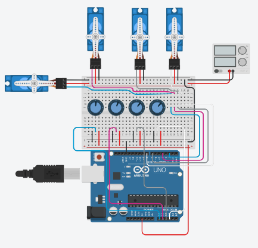

# Robotic Arm

Control of a robotic arm (allowing four freedom degrees).

### Materials

- 1 x Arduino UNO

- 1 x Servo SG90

- 4 x 10K potentiometer

- 2 x Axes joystick

- 1 x Protoboard

- 2 x 9V Battery

- 1 x Voltage regulator (Used to reduce the 9V battery to the 6V admitted by the SG90 Servo)

### Control modes

- [Using two joysticks | 2 x servos per joystick](./CODE/JOYSTICK/robotic-arm-joystick.ino)
- [Using four potentiometers | 1 x servo per potentiometer](./CODE/POTENTIOMETER/robotic-arm-potentiometer.ino)
  
### Wiring diagram

