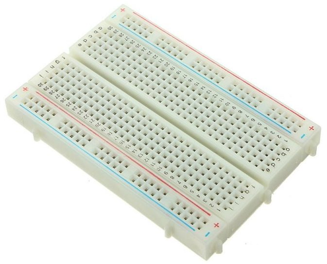

# Robotic Arm

Control of a robotic arm (allowing four freedom degrees).

### A bit of theory

- [Theory](THEORY.md)

### Materials

- 1 x Arduino UNO  
    

- 1 x Servo SG90  
  

- 4 x 10K potentiometer  
  
  
- 2 x Axes joystick  
  
  
- 1 x Kit jumpers  
  
  
- 1 x Protoboard  
  
  
- 2 x 9V Battery (1 x 9V battery per Arduino UNO; and 1 x 9V battery per servos)  
  
  
- 1 x Voltage regulator (Used to reduce the 9V battery to the 6V admitted by the SG90 Servo)  
  

### Control modes

- [Using two joysticks | 2 x servos per joystick](./src/robotic-arm-joystick.ino)
- [Using four potentiometers | 1 x servo per potentiometer](./src/robotic-arm-potentiometer.ino)
  
### Wiring diagram

