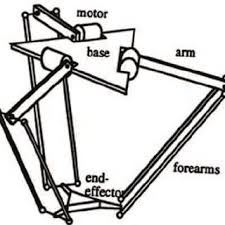

# Basic notions about robotics arms

The Robotics Industry Association (RIA) defines industrial robot as:  

> "An industrial robot is a reprogrammable multifunctional manipulator, capable of moving materials, parts, tools, or special devices, along variable trajectories, programmed to perform various tasks"  

The International Standards Organization (ISO) defines industrial robot as:

> "Reprogrammable multifunctional manipulator with various degrees of freedom, capable of manipulating materials, parts, tools or special devices along variable programmed paths to perform various tasks".

In short, an industrial robot arm is a mechanical arm with handling capabilities based on a more or less complex control.

## Structure of industrial robots

   

The axes are made up of joints joined together by links.  
A joint can be:
- __Linear__: (_Sliding, translational or prismatic_) if a link slides on an axis that is solidly connected to the previous link.  
- __Rotational__: if a link rotates around an axis that is connected to the previous link.  

  
  
  

  
The set of links and joints is called the kinematic chain. This kinematic chain will be open when each link is connected, exclusively by means of joints, to the previous and the next one, except for the first one, which is usually fixed to a support; and the last one, whose end is free. An end element such as a clamp, a soldering iron or a paint gun can be connected to this last link.  
The most important point of the end element is the terminal point (PT), which in the case of a clamp for example, can be considered as its attachment point. 

The terminal elements, attached to the wrist of the robot, are divided into two categories:  

- __Clamps or grippers__: Used to hold objects during the robot´s work cycle.  
- __Tools__: Used in very specific applications, such as arc welding or spray painting.

   
 

  

## Why robotic arm?

Manipulative robots are often called robotic arms because of their similarity to the human arm.

   

  

## Degrees of freedom

The degree of freedom of a robot arm is the maximum number of coordinates needed, and independent, to describe the state of the system (position).  
In open kinematic chains, each link has only one degree of freedom, either rotation or translation. A link can have more than one degree of freedom.

   

 

## Morphological configurations

Depending on the geometry of its mechanical structure, a manipulator can be:
- __Cartesian__: It is positioned in space by means of linear joints.  

   
  

  

- __Cylindrical__: It has a rotating base and linear joints for moovement in height and radius.  

   
  

  

- __Polar__: It has two rotational joints and one linear joint.
- __Spherical (or articulated arm)__: It has three rotational joints. It´s similar to the polar configuration.  

   
  

  

- __Mixed__: A mixture of the above.  
             Highlight the SCARA (Selective Compliance Assembly Robot Arm) configuration.  
             
- __Parallel__: Has arms with prismatic or rotational joints.  

   
   

  

## Source

- http://platea.pntic.mec.es/vgonzale/cyr_0708/archivos/_15/Tema_5.4.htm
- https://freedoomforlife.wordpress.com/grados-de-libertad/
